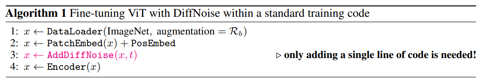

# 🌀 What Comes After Mixup and CutMix?  
### Revisiting Noise for Integrable Augmentation Axis

<p align="center">
  
</p>

<p align="center">
  
</p>

---

## ✨ Key Enhancements

- 💨 **Diffusion-inspired noise modeling** in the embedding space  
- 🎨 **Alpha blending** for high-quality feature-level reconstruction  
- 🎲 **Random noise injection** with controllable `alpha` parameters  
- 🚀 **Fine-tuning boosts** via integrable, embedding-aware augmentation  

---

## 🔧 Installation

### Requirements
```bash
pip install torch torchvision
pip install timm==0.3.2
pip install numpy pandas matplotlib
pip install diffusers
```

---

## 🏋️ Fine-tuning with Pre-trained Checkpoints

Run the following command to fine-tune using our enhanced augmentation strategy:

```bash
OMP_NUM_THREADS=16 torchrun --nproc_per_node=8 main_finetune.py \
    --finetune /path/to/checkpoint-400.pth \
    --model vit_large_patch16 \
    --batch_size 128 \
    --data_path /path/to/ImageNet \
    --output_dir ./outputs_pred_alpha_noise_add_embedding_space_noiserandom \
    --accum_iter 2 \
    --epochs 50 \
    --blr 1e-3 \
    --layer_decay 0.75 \
    --drop_path 0.2 \
    --reprob 0.25 \
    --mixup 0.8 \
    --cutmix 1.0 \
    --alpha_blend 15
```

---

## 🧪 MAE Fine-tuning Results

This table reports the fine-tuning accuracy of models pre-trained using **Masked Autoencoders (MAE)**, with and without the addition of **DiffNoise**.

| Model  | Pre-training Method   | Top-1 Acc (%) |
|--------|------------------------|---------------|
| ViT-B  | MAE                    | 82.92         |
| ViT-B  | MAE + DiffNoise        | **83.17**     |
| ViT-L  | MAE                    | 84.42         |
| ViT-L  | MAE + DiffNoise        | **84.61**     |


---

## 🛠️ Key Parameters

| Argument        | Description                                                                 |
|-----------------|-----------------------------------------------------------------------------|
| `--alpha_blend` | Controls strength of alpha-blending for diffusion-style augmentation (default: 15) |
| `--reprob`      | Probability of random erasing (augmentation regularization)                |
| `--mixup`/`--cutmix` | Standard image-level augmentation techniques                          |
| `--layer_decay` | Layer-wise learning rate decay to stabilize fine-tuning                   |

---

## 📈 Why Alpha-Blended Noise?

This approach enhances robustness and generalization by injecting structured, diffusion-style noise directly into the feature space—offering a powerful alternative or complement to traditional input-level augmentation like Mixup or CutMix.

---

## 📄 License
```
DiffNoise
Copyright (c) 2025-present NAVER Cloud Corp.
CC BY-NC 4.0 (https://creativecommons.org/licenses/by-nc/4.0/) 
```
